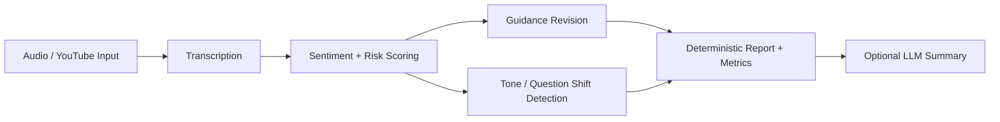

# AI Earnings Call Signal Engine
Transcript/audio-first signal extraction prototype for earnings calls. It produces structured, auditable artifacts to support retail trader review.

## What This Is
The **Earnings Call Signal Extraction Engine** converts a single earnings call into a structured signal summary focused on:
- guidance shifts
- tone-change moments
- transcript evidence

This project is **decision support only**. It is not a trading bot and does not execute orders.

## Status At A Glance
### Implemented now
- End-to-end CLI pipeline (`earnings-call-sentiment`) for:
  - YouTube/local audio ingestion
  - normalization + transcription
  - segment sentiment scoring
  - deterministic guidance extraction
  - deterministic guidance revision vs prior `guidance.csv`
  - deterministic tone-change detection
- Standard outputs including:
  - `transcript.json`, `transcript.txt`
  - `sentiment_segments.csv`, `chunks_scored.jsonl`
  - `guidance.csv`, `guidance_revision.csv`, `tone_changes.csv`
  - `metrics.json`, `report.md`, `run_meta.json`
- Optional question-shift outputs:
  - `question_sentiment_shifts.csv`, `question_shifts.png`
- Validation helper:
  - `scripts/verify_outputs.py`

### Optional / experimental
- Question-shift analysis (`--question-shifts`) is optional and heuristic.
- LLM narrative layer (`scripts/run_eval.py`) is optional; deterministic mode is available with `--llm none`.
- Backtest harness (`scripts/backtest_signals.py`) is available for offline analysis when local price data is provided.

### Unproven (do not over-interpret)
- No claim of live trading capability.
- No claim of statistical significance or persistent predictive edge from current repo artifacts alone.
- No claim that current heuristics generalize across all companies, sectors, or earnings-call styles.

## Architecture Flow
Input
→ Download/Load Audio
→ Transcribe
→ Score Segments
→ Detect Guidance Revision
→ Detect Tone Changes / Question Shifts
→ Build Deterministic Report
→ Optional LLM Summary Layer



The deterministic core is the source of truth. The optional summary layer is additive and never replaces core artifacts.

## Safest Demo Path (No External APIs)
Use pre-generated artifacts and deterministic scripts only.

### 1) Verify existing outputs
```bash
python scripts/verify_outputs.py --out-dir ./outputs_prior
```

### 2) Generate deterministic evaluation summary (no LLM/network)
```bash
python scripts/run_eval.py --out-dir ./outputs_prior --llm none
```

### 3) Present these files
- `outputs_prior/report.md`
- `outputs_prior/metrics.json`
- `outputs_prior/guidance.csv`
- `outputs_prior/guidance_revision.csv`
- `outputs_prior/tone_changes.csv`
- `outputs_prior/llm_eval.json` (from step 2)

If `outputs_prior/` is not available in your clone, prepare a local artifact folder first, then follow the same steps.

## Full Pipeline Run (Requires External Model/Media Access)
```bash
earnings-call-sentiment \
  --youtube-url "<earnings-call-url>" \
  --cache-dir ./cache \
  --out-dir ./outputs \
  --model tiny \
  --chunk-seconds 20 \
  --min-chars 20 \
  --symbol <TICKER> \
  --event-dt "2024-08-01T16:00:00" \
  --verbose
```

## Optional Summary Layer (Provider-based)
Summary mode is off by default. Enable it only when you want a narrative layer on top of deterministic artifacts.

Flags:
- `--llm-summary`
- `--summary-provider openai_compatible`
- `--summary-model <MODEL_ID>`
- `--summary-base-url <BASE_URL>`
- `--summary-api-key-env <ENV_VAR_NAME>`
- `--summary-timeout-s <SECONDS>`

Environment requirement (example):
```bash
export OPENAI_API_KEY=\"<secret>\"
earnings-call-sentiment \
  --youtube-url \"<earnings-call-url>\" \
  --out-dir ./outputs \
  --llm-summary \
  --summary-provider openai_compatible \
  --summary-model gpt-4o-mini \
  --summary-base-url https://api.openai.com/v1 \
  --summary-api-key-env OPENAI_API_KEY
```

Malformed provider JSON is normalized through hardened parsing (`schema_utils`) and is not trusted blindly.

## CLI Notes
Key reliability flags:
- `--strict`: enforce required artifact contract and fail if missing/empty.
- `--resume` / `--no-resume`: control post-score stage reuse.
- `--force`: rerun post-score deterministic stages.
- `--vad`: optional VAD during transcription.
- `--prior-guidance`: compare current guidance to a prior run.

## Evaluation Boundary
This capstone prototype is intended to improve **review speed, clarity, and auditability** for earnings-call interpretation. Any predictive or trading-performance claims require separate, rigorous out-of-sample validation.
